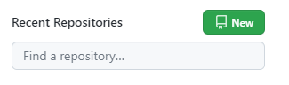
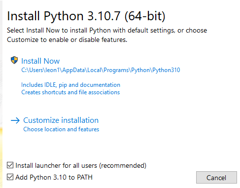
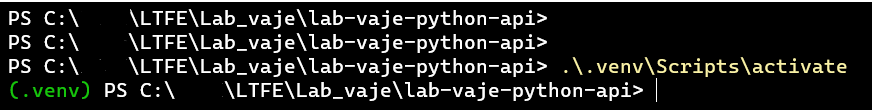

# Laboratorijska vaja 1: Priprava okolja

Na prvi laboratorijski vaji bomo pripravili okolje, ki ga bomo potrebovali skozi predmet. Pod podpoglavjem namestitev so navodila za namestitev posamezne programske opreme. Ta oprema je na fakultetnih računalnikih že nameščena, tako da tega koraka ni potrebno izvajat. Ta korak bo vam v pomoč pri pripravi okolja na lastnih računalnikih.

## Git in Github račun

### Namestitev
Gradiva in domače naloge boste tekom predmeta odajali na lasten Github repozitorji. Zato potrebujemo na računalniku nameščen Git. Namestimo ga tako, da iz [spletne strani](https://git-scm.com/download/win) prenesemo namestitveno datoteko (`Standalone Installer -> 64-bit Git for Windows Setup`). 

Zaženemo preneseno datoteko in sprejmemo privzete nastavitve. 

Za lažje delo lahko namestite Windows terminal.

> Windows terminal lahko namestite preko Microsoft Apps Store. Orodje za nahaja [tukaj](https://apps.microsoft.com/store/detail/windows-terminal/9N0DX20HK701?hl=sl-si&gl=si).

### Konfiguracija

Po uspešni namestitvi odpremo Windows Terminal. 

Z ukazom `git --version` v terminalu preverimo ali smo uspešno namestili Git.

Naslednji korak je, da ustvarimo Github račun. Na [spletni strani](https://github.com/signup?ref_cta=Sign+up&ref_loc=header+logged+out&ref_page=%2F&source=header-home) sledimo navodilom in ustvarimo nov račun. 

Po uspešno ustvarjenem računu lahko ustvarimo novi repozitoriji s klikom na gum `New`.



Za ime izpolnemo `TODO_NEKI`, izberemo `Public`, pri polju `Add .gitignore` izberemo `Python`. Ostalih polj ni potrebno spreminjat.

Ustvarjen repozitorji bomo klonirali na računalnik.

- TODO zmenit se kako to naridmo (faks, lastni računalniki) -> ne kolonirajo repoto v na faks računalnikih
- SSH ali token
- pokažemo par uakzov kako pushenmo spremembo na računalnik

## Namestitev VS Code

### Namestitev
Za urejevalnik besedil bomo uporabljali Visual Studio Code, ki ga lahko najdemo [tukaj](https://code.visualstudio.com/).

### Konfiguracija

Več informaciji o uporabi lahko najdete [tukaj](https://code.visualstudio.com/docs).

## Priprava Python okolja

### Namestitev

Namestimo [zadnjo verzijo Python-a](https://www.python.org/downloads/) na računalnik. Pri namestitvi pazimo, da pred namestitvijo izberemo opcijo `Add Python 3.10 to PATH` v namestitvenem meniju, ki se prikaže po zagonu prenesene datoteke.



Nadaljujemo z izbiro `Install Now`.

### Konfiguracija

Po uspešni namestitvi lahko preverimo uspešnost namestitve z ukazom `python --version` v terminalu.

Interaktivni Python interpreter zaženemo tako, da v terminal vpišemo `python`. Po zagonu lahko začnemo v terminal vpisovati veljavne Python ukaze. Interpreter zapustimo z `exit()`

Preden začnemo z delom bomo ustvarili še virtualno okolje. Ta korak ni nujen amapk je zelo priporočljiv saj omogoča, da bomo zunanje knjižnice namestili samo lokalno znotraj virtualnega okolja oz projekta. Virtualno okolje v praksi ustvarimo za vsaki nov projekt.

> Več o virtualnih okoljih si lahko preberete [tukaj](https://realpython.com/python-virtual-environments-a-primer/).

Prvi korak je, da se premaknemo v mapo v kateri bodo vsa gradiva za predmet (to je mapa, ki smo jo sklonirali iz Github-a).

Pred prvo uporabo moremo okolje najprej ustvariti (ta korak je potreben samo prvič):
- `python -m venv .venv` (.venv je ime virtualnega okolja, ime bi lahko bilo kar koli, vendar ga je dobra praksa poimenovat .venv)
- Python je ustvaril novo mapo `.venv` v kateri se nahaja virtualno okolje za predmet. To lahko preverimo z ukazom `ls`.

Naslednji korak je aktivacija okoja (to moramo storiti pred vsako uporabo). Okolje aktiviramo z ukazom `.\.venv\Scripts\activate`. Po aktivaciji se nam v terminalu pojavi `(.venv)` pred trenutno lokacijo.



Trenutno je okolje aktivirano, tako da vse namestitve zuanjih knjižnic bodo samodejno nameščene v virtualnem okolju. 

Po končanem delu lahko okolje deaktiviramo z ukazom: `deactivate`.

Zunanje odprtokodne knjižnice za Python lahko najdemo na strani https://pypi.org/. Za primer lahko vzamemo knjižnico [requests](https://pypi.org/project/requests/), ki jo bomo v nadaljevanju predmeta uporabili kot HTTP odjemalec. Za namestitev knjižnice moramo v terminalu zagnati (**prepričamo se da je virtualno okolje aktivirano!**) ukaz `pip install <IME_KNJIŽNICE>`, torej v našem primeru `pip install requests`. Python iz spleta prenese knjižnico in jo namesti na računalnik.

Odpremo glavno mapo predmeta v VS Code. Da bomo lažje delali s Python-om, namestimo še vtičnik za Python. Pritisnemo (`CTRL + SHIFT + X`) in vpišemo Python. Izberemo prvi vtičnik od Microsofta in ga namestimo.

Tako je okolje za Python pripravljeno. VS Code bo avtomatsko zaznal Python datoteko in pripravil potrebne zadeve.

## Python uvodni program
V glavni mapi predmeta ustvarimo novo mapo `lab_01_priprava_okolja`, v katero dodamo datoteko z imenom `moj_prvi_program.py`. V datoteko dodamo naslednjo vsebino:
```python
print("Hello Wolrd!")
```

Premaknemo se v mapo `cd lab_01_priprava_okolja` in zaženemo skripto z ukazom `python moj_prvi_program.py`. V terminal se izpiše sporočilo iz skripte. Uspelo nam je zagnati prvi Pytohn program.
